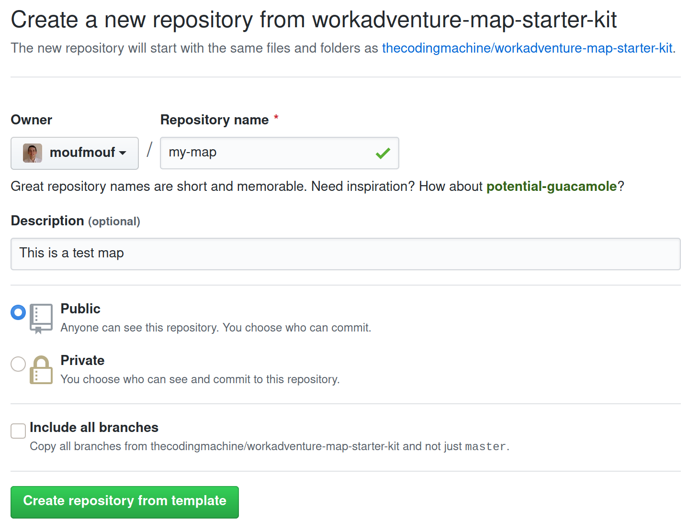
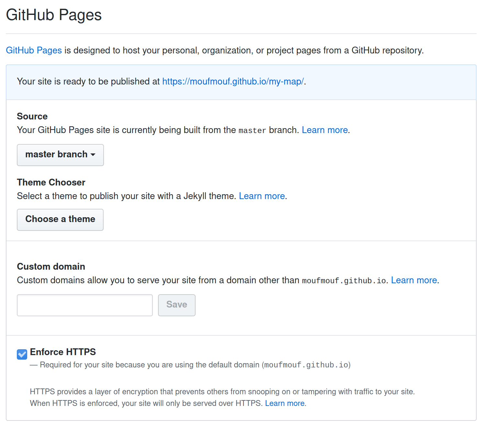

# WorkAdventure Education Map

This is a map for WorkAdventure based on the WorkAdventure starter Kit,
my wife use it for teaching her students while covid-19 Lockdown..

We ike to share this map with oteher teachers.
maybe it helps you to try WorkAdventure out in your remote teaching lessons.

## Getting started

- instruction soon
  

Be sure to keep the repository "Public".
**In Github:**

Go to **Settings tab** and scroll down to the **GitHub Pages** section.
Then select the **gh-pages** branch.

