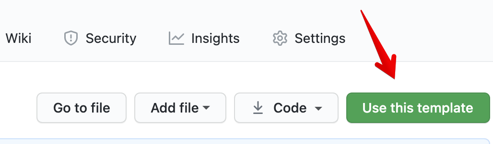
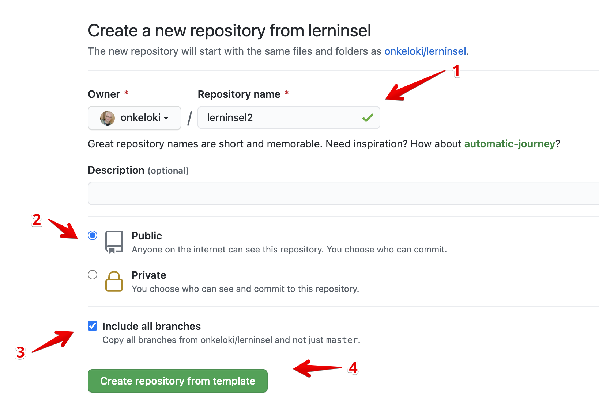
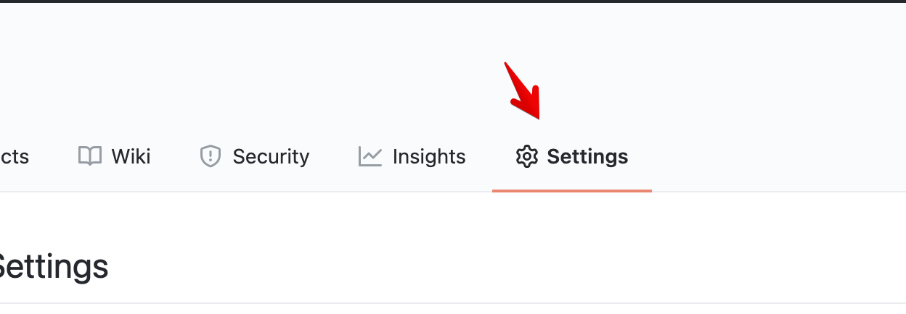
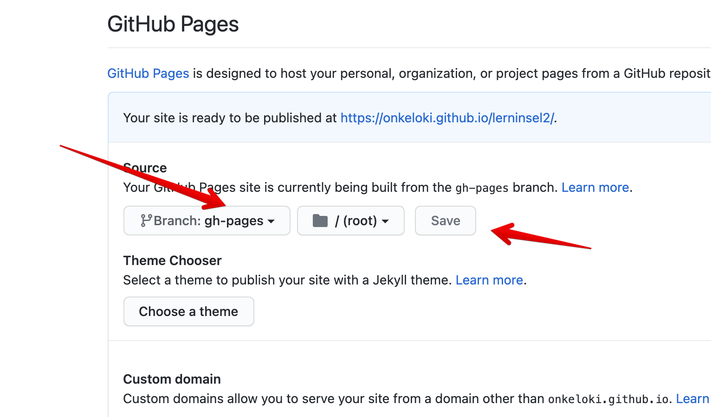
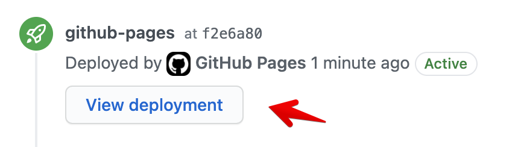

# lerninsel 

This is a map for [WorkAdventure](https://workadventu.re/) based on the WorkAdventure starter Kit.

My wife use it for teaching her students while covid-19 lockdown.

I ike to share this map with oteher teachers.
Maybe it helps you to try WorkAdventure out in your remote teaching lessons.

## Getting started

#### 1. Start by cloning this repo and use it as Template:

  
- 1.1 Give your copy of this code a name
  

- 1.2 Make sure your repo is punlic
- 1.3 check include all branches
- 1.4 finaly create your copy

#### 2. Launching the map:
Next thing yo have ro do is publish a github page
- 2.1 go to Settings 
scroll down to **GitHub Pages** section
  
  
  
- 2.2 choose branch **gh-pages** and **Save**

#### 2. Launching the map:
  
